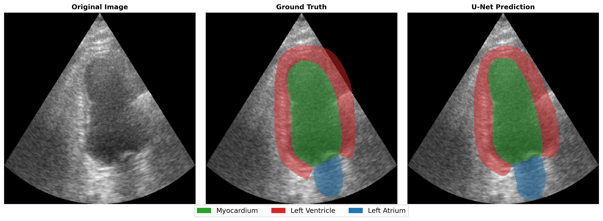

# U-LVEF: Clinical-Grade Left Ventricle Segmentation 

[](https://www.python.org/)
[](https://pytorch.org/)
[](https://lightning.ai/)
[](https://huggingface.co/datasets)
[](https://huggingface.co/datasets)
[](https://opensource.org/licenses/MIT)

**U-LVEF** is an end-to-end Deep Learning pipeline for the automatic segmentation of the left ventricle, myocardium, and left atrium from 2D echocardiographic images (CAMUS dataset).

## Key Features

* **Optimized U-Net Architecture:** Implementation of a custom, highly efficient U-Net variant (**UNetMini**) designed for cardiac segmentation. The architecture leverages a symmetric encoder-decoder structure with skip connections to preserve fine-grained spatial information, essential for accurate boundary delineation in echocardiography.
* **Patient-Level Data Split:** The dataset is split into Train/Val/Test ensuring that all images belonging to the same patient remain in the same set. This eliminates *Data Leakage* and ensures the Dice Score reflects the model's true generalization capability on unseen anatomies.
* **Hardware Efficiency:** Natively optimized for Apple Silicon (MPS) chips and hardware with limited unified memory.
* **Advanced Training Pipeline:** PyTorch Lightning implementation featuring `EarlyStopping`, `ModelCheckpoint`, and dynamic Learning Rate schedules (`CosineAnnealingWarmRestarts`) to prevent local minima and overfitting.

<br>
<p align="center">
  
  <br><em>Figure 1: Segmentation example (v3_model).</em>
</p>
</details>

---

## 📊 Dataset: The CAMUS Database

The project utilizes the **CAMUS** (CArdiovascular Magnetic Ultrasound) dataset, sourced via **Hugging Face Hub**. This version of the dataset is provided in a compressed format that requires specific preprocessing to extract clinical information and imaging data.

### Data Source & Format:
* **Source:** [Hugging Face Hub](https://huggingface.co/datasets) (CAMUS dataset).
* **Format:** The raw data is stored in `.gz` (Gzip) compressed archives.
* **Extraction:** The pipeline includes a custom extraction layer that processes these archives to retrieve:
    * **Temporal Sequences:** High-resolution echocardiographic frames captured at different cardiac phases.
    * **Clinical Metadata:** Essential parameters (such as image spacing and patient metadata) required for accurate **LVEF calculation**.

### Dataset Specifications:
* **Views:** Apical 2-chamber (2CH) and 4-chamber (4CH) views.
* **Cardiac Phases:** Full sequences from which **End-Diastole (ED)** and **End-Systole (ES)** frames are extracted for segmentation.
* **Ground Truth:** Manual expert segmentations provided by clinical cardiologists (Gold Standard).
* **Segmentation Classes:**
  1. **Background**
  2. **Left Ventricle Cavity** (Used for Volume/EF calculation)
  3. **Myocardium** (Used for wall thickening analysis)
  4. **Left Atrium**

### Clinical Relevance:
By extracting raw information directly from the source archives, the model maintains access to the full spatial and temporal context of the ultrasound study. This allows for a more precise estimation of hemodynamic parameters, bridging the gap between computer vision metrics (Dice Score) and clinical diagnostic metrics (Ejection Fraction).

---

## 📈 Model Optimization Journey (A/B Testing)

The development phase focused on optimizing the architecture and training routines to maximize the performance-to-computation ratio. 

| Version | Architecture & Setup | Params | Test Dice Score | Notes |
| :--- | :--- | :---: | :---: | :--- |
| **v1** | Standard U-Net Baseline | ~31 M | 0.9185 | Overly large network, risk of memorization. Low hardware efficiency (0.3 it/s). |
| **v2** | **U-Net Mini** (Refactoring) | **~1.9 M** | 0.9199 | **93% parameter reduction**. 10x speed increase while maintaining and exceeding clinical performance due to better generalization. |
| **v3** | U-Net Mini + Callbacks (Model Checkpoint + Early Stopping) | ~1.9 M | **0.9258** | Integration of `EarlyStopping` and `ModelCheckpoint` to capture the optimal weights before performance degradation. |
| **v4** | U-Net Mini + Cosine Annealing + Model Checkpoint| ~1.9 M | 0.9256 | Introduction of *Warm Restarts (SGDR)* to escape local minima during the final epochs. |

Learning rate set to 0.0001. Epochs: 20 for v1 and v2, 100 for v3 e v4.

---

## 📂 Project Structure

The code is highly modular, separating data processing, training logic, and clinical metric extraction.

```text
U-LVEF/
│
├── data/                   # (Auto-generated) folder for the dataset
├── src/
│   ├── download_data.py    # Downloads the CAMUS dataset from HuggingFace Hub
│   ├── preprocess.py       # Converts .mhd/.raw images into standardized .npy tensors
│   ├── utilities.py        # Core logic: PyTorch Lightning Module, Dataset, UNet 
│   └── main.py             # Entry point: Training loop, Logging, and chart generation
│
├── checkpoints/            # Best model weights (.ckpt) for each version
├── logs/                   # (Auto-generated) CSV metrics and training curves
├── checkpoints/            # (Auto-generated) Best model weights (.ckpt)
├── assets/                 # loss plots for models versions and example of image segmentation and EF (of v4 model)
├── requirements.txt 
├── .gitignore
└── README.md
```

---

## Getting Started

### Prerequisites
Ensure you have Python 3.10+ installed. It is highly recommended to use a virtual environment (`venv` or `conda`).

### 1. Installation
Clone the repository and install the required dependencies:
```bash
git clone [https://github.com/MarcoSiro/u-lvef.git](https://github.com/MarcoSiro/u-lvef.git)
cd u-lvef
pip install -r requirements.txt
```

### 2. Download and Preprocess the data
```bash
python src/download_data.py
python src/preprocess.py
```

### 3. Run the Pipeline (Train & Test)
Execute the main script to start the PyTorch Lightning trainer. Upon completion, the script automatically tests the model and generates loss e dice (val) curves reports in the `logs/` directory.
```bash
python src/main.py
```

### 4. Load Pre-Trained Weights
The checkpoints for every best model version are included in the /checkpoints folder. To load the model for inference:
```python
model = LightningModel.load_from_checkpoint("checkpoints/best-model-v1(2,3,4).ckpt")
```

---

## Author & License
**Marco Sironi** *Cardiology Resident & Health-Tech Developer*

This project is licensed under the MIT License - see the [LICENSE](LICENSE) file for details.